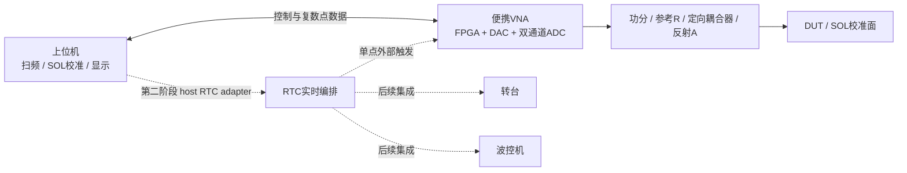

# Portable VNA

一个面向学习、验证和低成本天线测试的便携式直采矢量网络分析仪项目。

本项目的最高目标是：用尽量简单的结构实现一台低成本、小体积、可独立使用的矢量网络分析仪；在第一阶段测量闭环稳定后，再通过 host 侧适配器接入 RTC、转台和波控设备，组成低成本天线快速测试系统。

> 当前状态：实验原型。现有结果主要是架构、文档、RTL 模块和离线数字验证，不代表真实射频、JESD 或整机指标已经通过。

## 第一阶段 MVP

- 一端口复数反射测量 `S11`。
- 直采结构，不设置上下变频模块。
- AD9144 的一个 DAC 通道产生激励。
- AD9250 两个 ADC 通道分别采集参考通道 `R` 和反射通道 `A`。
- ADC 模拟接口按真正的 `50 Ω` 系统设计和核算。
- 使用经济型成品定向耦合器完成反射取样。
- FPGA 输出积分后的复数 `R/A` 点数据，上位机计算 `A/R`、执行 SOL 校准并显示结果。
- 首轮真实硬件闭环优先验证 `5–100 MHz`；更宽频段在后续实测后逐步扩展。

第一阶段必须能够脱离 RTC 独立扫频、采集、校准和保存数据。RTC 状态机、转台扫描、波控表和 HDF 业务逻辑不进入 VNA 核心。

## 总体结构



## 仓库结构

```text
portable-vna/
├─ LICENSE.md                      # 分层许可适用范围
├─ LICENSES/                       # 三份完整许可证原文
├─ hardware/                       # 系统与射频结构规划
├─ software/FPGA/                  # FPGA RTL、仿真、脚本与实施路线
├─ docs/protocol/                  # 原创 RTC V0.7 协议
├─ docs/RTC_INTEGRATION_BOUNDARY.md
├─ docs/THIRD_PARTY_SOURCES.md     # 未随仓库分发的厂商资料与下载入口
└─ README.md
```

重要入口：

- [整体结构规划](hardware/SYSTEM_ARCHITECTURE.md)
- [FPGA 工程说明](software/FPGA/README.md)
- [FPGA 编码规范](software/FPGA/FPGA_CODING_STANDARD.md)
- [软件实施路线](software/FPGA/SOFTWARE_IMPLEMENTATION_ROADMAP.md)
- [RTC 后续集成边界](docs/RTC_INTEGRATION_BOUNDARY.md)
- [RTC V0.7 协议](docs/protocol/host_rtc_protocol_v0.7.md)
- [第三方资料获取说明](docs/THIRD_PARTY_SOURCES.md)

## 当前实现状态

- 目标器件：Xilinx Kintex UltraScale `xcku5p-ffvb676-2-i`。
- 当前工具基线：Vivado 2025.2。
- 已有 LMK04828、AD9250、AD9144 的只写 SPI 配置控制模块、示例配置 ROM、自动自检仿真与 OOC 脚本。
- 示例配置 ROM 仍是占位数据，默认禁止向真实器件误发送。
- `software/FPGA/rtl/top.v` 仍是空顶层，尚未连接真实管脚。
- 尚未完成真实 SPI、LMK 锁定、JESD204B、DAC/ADC 数据链路、射频前端或 SOL 校准的硬件验证。

详细证据边界见 [FPGA 工程说明](software/FPGA/README.md) 和各模块验证记录。

最小工程重建入口：

```powershell
vivado -mode batch -source software/FPGA/scripts/create_project.tcl
```

脚本生成的工程位于 `software/FPGA/build/vivado/`，该目录不进入版本控制。

## RTC 后续集成

RTC 协议和自动测试逻辑属于本项目后续扩展输入。推荐保持以下边界：

- VNA：一次外部触发对应一个可关联频点的复数结果。
- RTC：负责实时触发、波位、TR 窗口及进度/故障编排。
- 上位机：保持唯一业务状态机，负责计划、校准、数据保存、回放和报告。

第一阶段只预留外部触发、READY/BUSY/DONE、复数点数据、关联标识和安全停止能力。详细接口及台架验证矩阵见 [RTC 后续集成边界](docs/RTC_INTEGRATION_BOUNDARY.md)。

## 第三方资料

仓库不提交厂商安装程序、RAR 压缩包、芯片数据手册、板卡原理图、Vivado 生成物或未经确认允许再分发的 Demo。对应型号和官方获取入口记录在 [第三方资料获取说明](docs/THIRD_PARTY_SOURCES.md)。

## 开源许可

本项目采用分层许可：

- FPGA RTL、仿真、脚本及其他软件内容：`Apache-2.0`。
- 原创硬件设计源：`CERN-OHL-P-2.0`。
- 原创文档和 RTC V0.7 协议：`CC-BY-4.0`。

完整范围和许可证原文见 [LICENSE.md](LICENSE.md)。三方资料不在上述授权范围内。

## 贡献与反馈

欢迎通过 Issue 或 Pull Request 讨论架构、RTL、校准算法、射频前端和验证方法。提交验证结果时请明确区分：文档分析、离线仿真、综合/实现以及真实硬件测试。

## 作者

lvshuang `<15565374073@163.com>`
