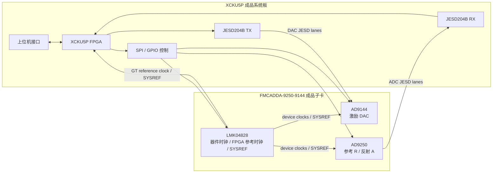
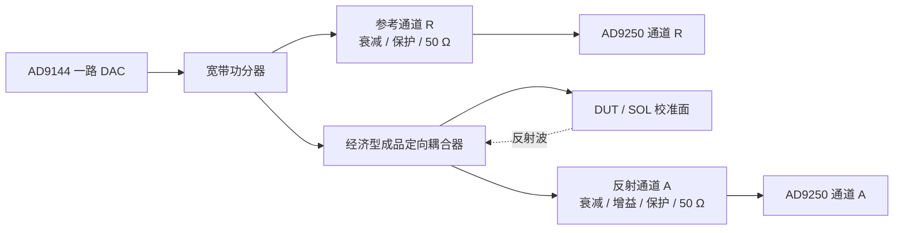

# 成品板验证硬件基线

## 1. 阶段结论

当前直采验证阶段不自主设计 FPGA 系统板或 AD/DA 子卡，直接使用已购买的两块成品板：

| 成品模块 | 当前用途 | 用户提供的采购来源 | 当前证据边界 |
|---|---|---|---|
| XCKU5P FPGA 系统板 | FPGA、GT/JESD、控制、时钟接入和上位机通信的验证载体 | [淘宝商品 ID 1024670831801](https://item.taobao.com/item.htm?id=1024670831801) | 已购买；商品页在未登录状态下无法核对详细参数，板卡版本和实物接口待上电前盘点 |
| FMCADDA-9250-9144 子卡 | AD9144 激励输出、AD9250 双通道采集和 LMK04828 时钟同步 | [淘宝商品 ID 823636332778](https://item.taobao.com/item.htm?id=823636332778) | 已购买；芯片组成来自子卡型号和本地厂商资料，尚未完成实物上电验证 |

这两块板卡属于验证平台，不代表最终低成本、小体积硬件形态。只有在真实 SPI、时钟、JESD204B、DAC/ADC、`R/A` 复数测量和 SOL 校准闭环通过后，才进入自主原理图和 PCB 设计。

## 2. 成品板间接口图（项目原创抽象）

上图是本项目根据验证需求自行绘制的功能与信号方向图，不是厂商原理图的裁剪或替代。FMC 管脚、GT Quad/lane、时钟管脚、SPI 片选和复位信号必须再根据手上实物版本和厂商资料逐项复核，未复核前不写入最终 XDC。

## 3. 直采 VNA 验证接线图（项目原创抽象）

当前不冻结子卡 SMA 座和 AD9250 A/B 物理通道对应关系；该对应必须通过实物丝印、通断关系、厂商资料和上电注入信号共同确认。

## 4. 验证后的自主硬件设计

自主硬件不会直接复制成品板，而是从验证数据中反推最小需求：

1. 冻结 FPGA 规模、GT lane、时钟、存储和上位机接口。
2. 冻结 DAC/ADC 速率、通道数、模拟带宽、输入满量程和 `50 Ω` 前端功率预算。
3. 根据直采实测结果设计最终上下变频、本振、滤波、衰减、增益和开关链路。
4. 去除成品系统板上与 VNA 无关的外设，以小体积、低成本和可测试性为目标设计原理图和 PCB。

自主设计文件将作为本项目原创硬件源，按 `CERN-OHL-P-2.0` 发布。

## 5. 第三方原理图的公开边界

用户本地资料库中存在 XCKU5P 系统板和 FMCADDA-9250-9144 的原理图 PDF，但当前未发现明确的开源许可或再分发授权。因此：

- 购买成品板和注明出处不自动产生公开再分发权；
- 不将原始 PDF、SchLib、PcbLib、Demo 压缩包或裁剪后的原理图页直接加入公开仓库；
- 公开仓库只保存采购来源链接、项目自行绘制的抽象图、我们自己的测量数据和自主硬件源；
- 如后续获得卖家或制造商的书面公开许可，再在保留原始来源、版本、权利人、许可证和许可证据的前提下单独评审是否纳入。
