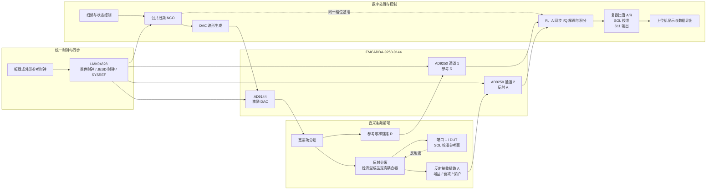
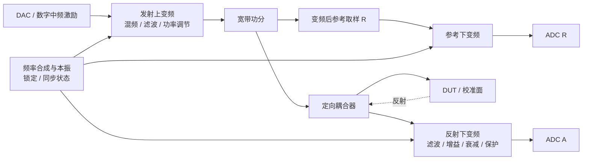

# 便携矢网：当前直采原型与最终变频扩展规划

> 本文档的主体框图描述当前直采验证原型。项目最终目标不限于直采；直采复数测量和校准闭环验证后，将集成上下变频射频前端以扩展频段。

## 1. 第一阶段目标

- 一端口复数反射测量：S11。
- 采用直采结构，当前不配置上下变频，以减少首轮验证变量。
- 一个 DAC 通道产生扫频激励。
- ADC 通道 1 作为参考通道 R。
- ADC 通道 2 作为反射测量通道 A。
- 先完成系统结构、接口和信号流定义，不进入 RTL、软件或 PCB 实现。

首轮真实硬件闭环仅保证以 `5–100 MHz` 为目标验证区间。约 0.5 MHz 至 350 MHz 可作为直采探索区间，但未经实测前不承诺指标；更高频段交由最终上下变频前端扩展。

## 2. 整体结构框图

## 3. 最终目标中的上下变频扩展

参考 R 应在发射上变频之后取样，使它能跟踪真正送往 DUT 的源幅相以及发射变频链路漂移。R 与 A 的接收下变频必须使用可关联的本振和确定性时序，并保留原始复数数据供校准和重算。

本振频率规划、中频、混频器、滤波器、镜像抑制、杂散、隔离度和功率预算均在直采原型通过后冻结。变频前端应保持可替换的模块边界，并可视实测结果保留低频直采/旁路模式。

## 4. 各部分职责

### 激励链路

公共 NCO 决定扫频点，AD9144 输出单音。射频前端把激励分成两路：一路送
参考通道 R，另一路通过反射分离器件送到 DUT。

### 参考通道 R

参考点放在功分器之后，使 R 能观察实际送入射频前端的源幅度和相位。它用于
逐频点归一化，避免把 DAC 幅频响应和公共相位漂移误认为 DUT 特性。

### 反射通道 A

经济型成品定向耦合器分离 DUT 返回的反射波。A 链路预留增益、衰减和输入
保护，但本阶段不确定具体器件和增益数值。

### 数字处理

R、A 两路必须同步采集，并使用与激励同源的相位基准分别得到复数 I/Q。
数字处理先形成原始复数比值 `m = A/R`，再通过 Open、Short、Load 三项校准
得到 S11。

### 控制与显示

上位机负责扫频参数、校准流程、曲线显示、标记读取以及后续 Touchstone 数据
导出。是否采用板载软核或外部 PC，留到接口规划阶段决定。

## 5. 当前保留的设计选择

1. 经济型成品定向耦合器的具体型号、工作带宽、方向性、耦合度和插入损耗。
2. 是否在 DAC 输出侧增加可调衰减和源放大。
3. A 通道需要多少接收增益，以及是否分档。
4. 控制接口采用千兆以太网、USB，还是先用调试接口。
5. 首版只做 S11，还是为下一阶段 S21 预留端口和开关位置。

## 6. 下一步规划顺序

1. 冻结首版频段和目标动态范围。
2. 选定经济型成品定向耦合器，并实测带宽、方向性和损耗。
3. 做 R、A 两条通道的功率预算和 ADC 裕量预算。
4. 再确定射频前端器件与原理图。
5. 硬件结构冻结后才进入 FPGA 和软件实现。
